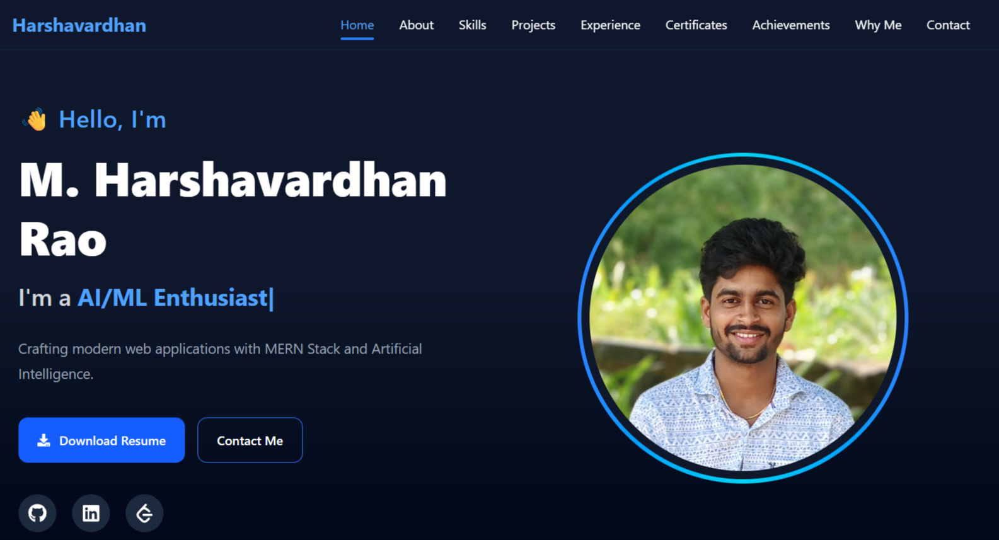

# 🚀 Harshavardhan Portfolio

A modern, responsive, and animated developer portfolio showcasing my skills, projects, certifications, achievements, and experience in Full Stack Development and Artificial Intelligence.

---

## 🌐 Live Demo

🔗 https://your-portfolio-url.vercel.app


---

## 📸 Preview



---

## ✨ Features

- Modern UI with clean design
- Fully Responsive Layout
- Smooth Framer Motion Animations
- Premium Glassmorphism Cards
- AI & Full Stack Focused Portfolio
- Interactive Hero Section
- About Me Section
- Skills Showcase
- Projects Showcase
- Experience Timeline
- Certifications Section
- Achievements Section
- Why Work With Me Section
- Contact Section
- Resume Download
- Scroll Progress Indicator
- Back To Top Button
- SEO Optimized
- Fast Loading using Vite

---

## 🛠 Tech Stack

### Frontend

- React.js
- Vite
- Tailwind CSS
- Framer Motion

### Backend

- Node.js
- Express.js
- MongoDB

### Programming Languages

- Java
- Python
- JavaScript

### AI / Machine Learning

- NumPy
- Pandas
- Scikit-Learn
- Machine Learning
- Deep Learning

### Tools

- Git
- GitHub
- VS Code

---

## 📂 Project Structure

```
portfolio/
│
├── public/
│   ├── preview.png
│   ├── robots.txt
│   ├── sitemap.xml
│   ├── favicon.svg
│   └── Madikonda_Harshavardhan_Rao_Resume.pdf
│
├── src/
│   ├── components/
│   ├── animations/
│   ├── data/
│   ├── assets/
│   ├── App.jsx
│   └── main.jsx
│
├── index.html
├── package.json
└── README.md
```

---

## 🚀 Installation

Clone the repository

```bash
git clone https://github.com/Harsha-madikonda/Portfolio.git
```

Go to the project directory

```bash
cd portfolio
```

Install dependencies

```bash
npm install
```

Run the development server

```bash
npm run dev
```

Build for production

```bash
npm run build
```

Preview production build

```bash
npm run preview
```

---

## 📖 Sections

- Home
- About
- Skills
- Projects
- Experience
- Certifications
- Achievements
- Why Work With Me
- Contact

---

## 📱 Responsive Design

The portfolio is fully responsive and optimized for

- Desktop
- Laptop
- Tablet
- Mobile Devices

---

## ⚡ Performance

- Fast Vite Build
- Optimized Images
- Lazy Animations
- SEO Friendly
- Responsive Design
- Accessible Layout

---

## 📬 Contact

**Harshavardhan Rao**

📧 Email:
madikondaharshavardhanrao@gmail.com

📍 Location:
Telangana, India

---

## 🔗 Connect With Me

GitHub:
https://github.com/Harsha-madikonda

LinkedIn:
https://www.linkedin.com/in/madikondaharshavardhan/

LeetCode:
https://leetcode.com/u/Madikonda-Harshavardhan/


---

## 📄 License

This project is created for personal portfolio purposes.

---

## ❤️ Built With

- React.js
- Tailwind CSS
- Framer Motion
- Vite

---

## 👨‍💻 Author

**Madikonda Harshavardhan Rao**

Passionate Full Stack Developer & AI/ML Enthusiast dedicated to building scalable web applications and AI-powered solutions.

⭐ If you like this project, consider giving it a star on GitHub!